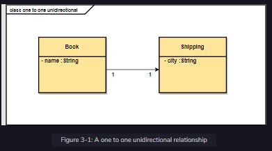

A one-to-one bi-directional relationship is a one-to-one relationship that refers back both ways, from parent to child and vice versa. If you find a real-life situation where the relationship is one-to-one and you need to traverse in both directions, then use a one-to-one bi-directional relationship.

 

  
 
