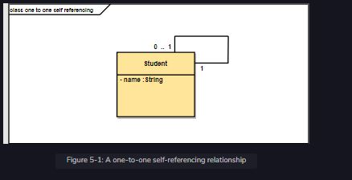

A one-to-one self-referencing relationship is a one-to-one relationship that refers to its own instance. We will start with the user interface, followed by the service development, and then join both units at the close of the chapter.

 

  
 
