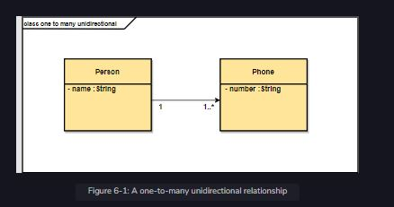

A one-to-many unidirectional relationship is a one-to-many relationship that has a reference from parent to child, but not vice versa. We start with the user interface, followed by the service development, and integrate both the modules at the end of the chapter.

 

  
 
