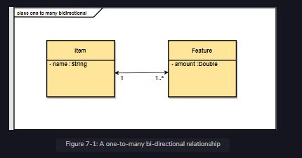

A one-to-many bi-directional relationship is a one-to-many relationship that has a reference from parent to child and also vice versa. We will survey the accustomed flow of starting with the user interface shadowed by the service development and assimilating both of the components at the close of the chapter.

 

  
 
