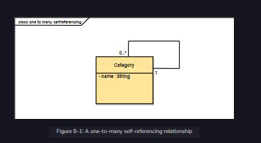

A one-to-many self-referencing relationship is a one-to-many relationship that has a reference to itself. We’ll start with the user interface and finish with the service development, covering both mechanisms by the end of the chapter.

 

  
 
