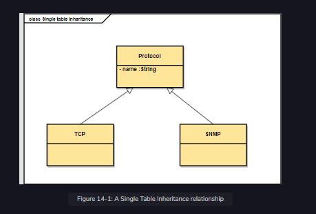

This chapter is a primer to the process of development with a single table inheritance relationship. We will create the user interface at the beginning and then write the real service. In the end, we will integrate both the solutions and arrive at a reasonable conclusion.

 

  
 
