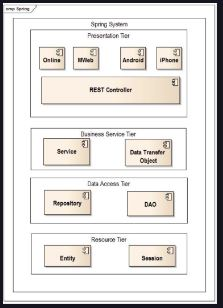

## What is Software Architecture

### What is software architecture?

Software architecture refers to the higher-level building blocks of a software system. Like architecture in the real world, software architecture defines the high-level system structure of the software components, the discipline of creating the component hierarchy, and the documentation of this structure. It also forms a set of architectural design decisions that show the structure and the rationale behind it.

### Non-functional requirements

When we look at how software development started, we mainly see a focus on the required functionality and a data-driven flow. However, modern application development has extended the focus to quality attributes such as:
*
* Extensibility

* Reliability

* Performance

* Scalability

* Maintainability

* Availability

* Security

* Backward compatibility

* Usability

These attributes play an important role in software architecture and are popularly known as non-functional requirements.

# REST

`REST (REpresentation State Transfer)` is an architectural style of networked systems, such as Web applications. REST was first introduced in 2000 in Roy Fielding’s ’s Ph.D. dissertation. Roy Fielding was one of the writers of the HTTP specificatio

## Frameworks for RESTful web services

There are three popular RESTful Web Services frameworks: `Jersey`, `Restlet`, and `Spring`.

`Jersey RESTful Web Services` is an open-source framework for developing RESTful Web Services in Java that provides support for JAX-RS APIs, constituted by Oracle’s Java EE 7 JAX-RS specifications (JSR 311 & JSR 339). Jersey is a Reference Implementation.

`Restlet` is a lightweight, open-source REST framework for the Java platform. Restlet API derives the name of its classes directly from the REST concepts (resource, representation, connector, component, media type, language), indicating that one is able to think RESTfully to easily translate a solution into code.

The third framework for building RESTful Web Services is the `Spring framework`, where REST support is assimilated flawlessly into the Spring MVC. In this course, we will focus on using the Spring framework to build RESTful services.

# Web Frameworks

There are currently two major approaches for web development: `server-side MVC` and `client-side MVC.`

### Server-side MVC

Server-side MVC renders all pages on the server. Popular examples of this framework include [Java Server Faces (JSF)](http://www.javaserverfaces.org/), [Oracle ADF](https://www.oracle.com/database/technologies/developer-tools/adf/), [JBoss Seam](https://www.seamframework.org/), and [Spring MVC](https://docs.spring.io/spring-framework/docs/current/reference/html/web.html).

### Client-side MVC

`Client-side MVC` combines Java Server Pages (JSP) and jQuery, along with a REST API. There are specialized forms of jQuery like Angular and Backbone that can be used, and a REST API can be developed using Spring REST support.

### Persistence mechanism

Persistence is the ability to store the state of an object in non-volatile storage, such as a hard disk. Oracle Java EE 7 provides two basic mechanisms for implementing the persistence tier of a web application:

* The first approach is to use the [Java Database Connectivity API (JDBC)](https://docs.oracle.com/javase/8/docs/technotes/guides/jdbc/), which provides methods for querying and updating data in a database.

* The second approach is to use the [Java Persistence API (JPA)](https://docs.oracle.com/javaee/6/tutorial/doc/bnbpz.html), which describes the management of relational data in applications. Here, we will use the second approach with Hibernate, which is an implementation of the JPA specification. Hibernate-specific annotations have been intentionally avoided, and we will only cover the use of only JPA annotations.

 

    

 

### Test-driven development

Then the developer writes the minimum amount of code to pass the test, and finally refactors the code to achieve the accepted standards. Please note that the test cases should not be dependent on each other and can be executed in any sequence or order. Also, the test cases should not be written based on the assumption of any state of the system, like hard-coded identifiers.

One common mistake is not treating the test code with respect. Your test code should be treated with the same respect as your production code and must work correctly for positive as well as negative cases.
